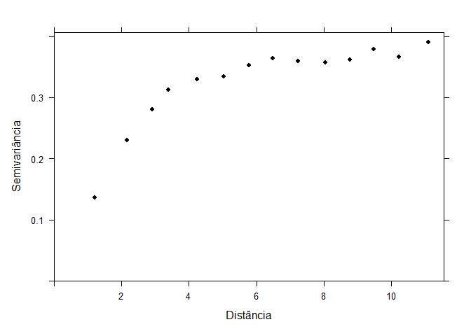
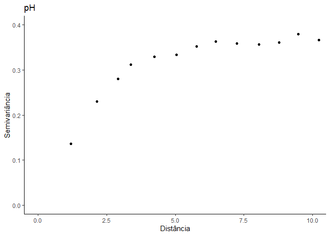
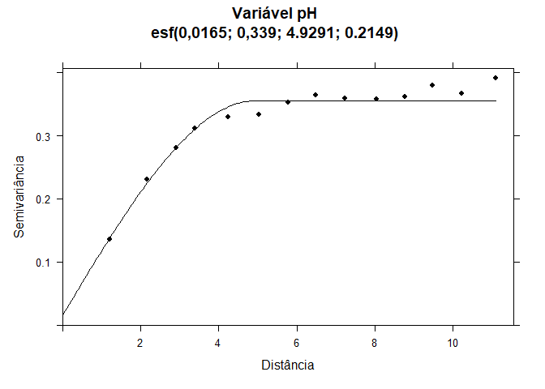
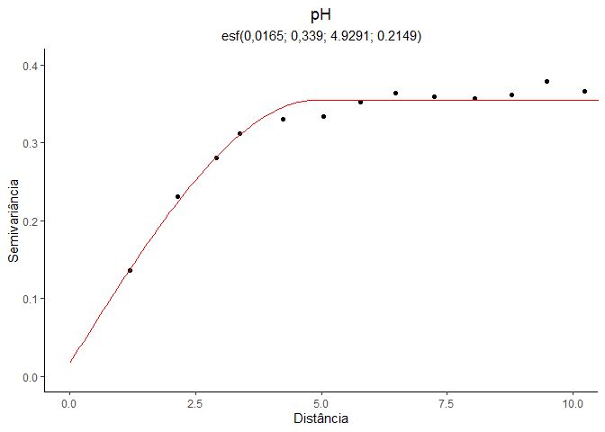
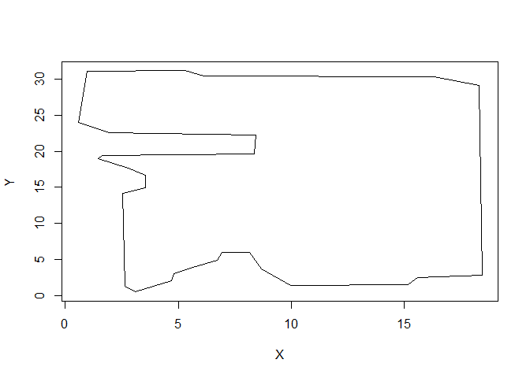
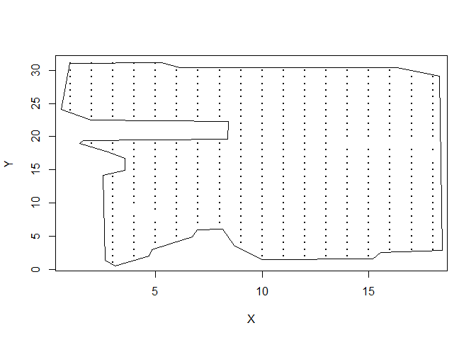
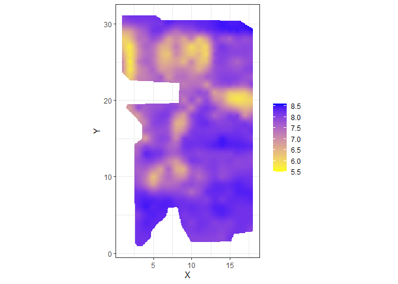

<!-- README.md is generated from README.Rmd. Please edit that file -->

# Utilizando o ggplot2 para o mapeamento da krigagem

## Carregando os pacotes

``` r
library(sp)       # pacote para chamar shapes
library(maptools) # pacote para editar mapas
library(raster)   # pacote para chamar rasteres
library(gstat)    # pacote geoestatística
library(graphics) # pacote gráfico
library(lattice)  # pacote lattice
library(tidyverse)  # pacote tidyverse
```

### Duas opções

-   1ª) determine o caminho de procura do arquivo de dados acionando as
    abas no RStudio:
-   Session/Set Working Directory/Choose Directory/…, ou
-   2ª) pela área de trabalho (clipboard)

## Entrada de dados

``` r
dados_broom<-read.table("data/BroomBarnFarm.txt",h=T) # lendo o arquivo de dados pelo caminho indicado
head(dados_broom)   
#>   X  Y  K  pH   P
#> 1 1 24 26 7.2 5.5
#> 2 1 25 22 7.2 5.2
#> 3 1 26 18 6.8 2.6
#> 4 1 27 19 6.4 1.3
#> 5 1 28 26 6.1 1.3
#> 6 1 29 23 6.6 6.9
```

## Definindo as coordenadas do objeto de classe espacial do pacote `{sp}` (SpatialPointsDataFrame).

``` r
coordinates(dados_broom) <- c("X","Y") 
str(dados_broom)
#> Formal class 'SpatialPointsDataFrame' [package "sp"] with 5 slots
#>   ..@ data       :'data.frame':  435 obs. of  3 variables:
#>   .. ..$ K : num [1:435] 26 22 18 19 26 23 32 28 55 19 ...
#>   .. ..$ pH: num [1:435] 7.2 7.2 6.8 6.4 6.1 6.6 7.8 8 6.8 6 ...
#>   .. ..$ P : num [1:435] 5.5 5.2 2.6 1.3 1.3 6.9 6.6 7.8 2.6 1 ...
#>   ..@ coords.nrs : int [1:2] 1 2
#>   ..@ coords     : num [1:435, 1:2] 1 1 1 1 1 1 1 1 2 2 ...
#>   .. ..- attr(*, "dimnames")=List of 2
#>   .. .. ..$ : NULL
#>   .. .. ..$ : chr [1:2] "X" "Y"
#>   ..@ bbox       : num [1:2, 1:2] 1 1 18 31
#>   .. ..- attr(*, "dimnames")=List of 2
#>   .. .. ..$ : chr [1:2] "X" "Y"
#>   .. .. ..$ : chr [1:2] "min" "max"
#>   ..@ proj4string:Formal class 'CRS' [package "sp"] with 1 slot
#>   .. .. ..@ projargs: chr NA
```

## Contrução do variograma da variável alvo

``` r
(v_pH<-variogram(pH~1,dados_broom)) # calculando e imprimindo o arquivo do variograma experimental 
#>      np      dist     gamma dir.hor dir.ver   id
#> 1  1550  1.200960 0.1363387       0       0 var1
#> 2  2144  2.154589 0.2304897       0       0 var1
#> 3  1347  2.915678 0.2804417       0       0 var1
#> 4  2549  3.377915 0.3121891       0       0 var1
#> 5  3613  4.232938 0.3297246       0       0 var1
#> 6  2846  5.040046 0.3338949       0       0 var1
#> 7  4274  5.780975 0.3522625       0       0 var1
#> 8  2966  6.475619 0.3635941       0       0 var1
#> 9  4709  7.235795 0.3589318       0       0 var1
#> 10 3923  8.040342 0.3572878       0       0 var1
#> 11 4014  8.778705 0.3616168       0       0 var1
#> 12 4024  9.474051 0.3794061       0       0 var1
#> 13 4483 10.237231 0.3667109       0       0 var1
#> 14 5046 11.112653 0.3906084       0       0 var1
plot(v_pH,pl=F,pch=16,col=1,   # gráfico do variograma 
     xlab="Distância",
     ylab="Semivariância") 
```

<!-- --> \###
Reproduzir usando o ggplot2

``` r
v_pH %>% 
  ggplot(aes(x=dist, y=gamma)) +
  geom_point() +
  theme_classic() +
  labs(x="Distância", y="Semivariância", title = "pH") +
  coord_cartesian(xlim = c(0,10), ylim = c(0,.4))
```

<!-- -->

## Modelagem do semivariograma

``` r
(m_pH <- fit.variogram(v_pH,vgm(0.35,"Sph",6,0)))
#>   model      psill    range
#> 1   Nug 0.01648869 0.000000
#> 2   Sph 0.33864235 4.929135
```

### Calculando e imprimindo a soma de quadrados do erro (SQErro)

``` r
(sqr_pH<-attr(m_pH, "SSErr"))
#> [1] 0.2148565
```

### Gráfico do variograma experimental com o modelo ajustado

``` r
plot(v_pH,model=m_pH, col=1,pl=F,pch=16,
     xlab="Distância",
     ylab="Semivariância",
     main =" Variável pH\n esf(0,0165; 0,339; 4.9291; 0.2149)")
```

<!-- -->

## Semivariograma usando o ggplot2

``` r
preds = gstat::variogramLine(m_pH, maxdist = max(v_pH$dist))
v_pH %>% 
  ggplot(aes(dist, gamma)) +
  geom_point() +
  geom_line(data = preds, color="red") +
    theme_classic() +
  labs(x="Distância", y="Semivariância", title = "pH",
       subtitle = "esf(0,0165; 0,339; 4.9291; 0.2149)") +
  coord_cartesian(xlim = c(0,10), ylim = c(0,.4))+
  theme(plot.title = element_text(hjust=0.5),
        plot.subtitle = element_text(hjust=0.5))
```

<!-- -->

## Criando GRID

``` r
dist <- 0.1 #  Distancia entre pontos
grid_broom <- expand.grid(X=seq(min(dados_broom$X),max(dados_broom$X),dist), Y=seq(min(dados_broom$Y),max(dados_broom$Y),dist))
coordinates(grid_broom) <- ~ X + Y
# grid_broom<-as(grid_broom,"SpatialPixelsDataFrame")
```

## 1ª) opção - criar o Contorno com o script a seguir

``` r
# plot(dados_broom, pch=16)
# coords <- locator(type="l", col='red') # Desenhando contorno
#coords <- as.data.frame(coords) # display list
#coords = rbind(coords, coords[1,]) # igualando primeiro e ultimo ponto
#contorno =SpatialPolygons( list(Polygons(list(Polygon(coords)), 1))) #Trasnformação do arquivo contorno em poligono
#X11() 
#plot(contorno,lwd=2) # imprimindo o contorno
```

## 2ª) opçao - leitura do arquivo contorno (Atenção!! É necessário estabelecer o caminho de leitura )

``` r
coords_contorno<-read.table("data/contornoBroomBarnFarm1.txt",h=T)
head(coords_contorno)
#>            X         Y
#> 1  0.9617593 31.082781
#> 2  5.2958916 31.169463
#> 3  6.1193768 30.432661
#> 4 16.3045878 30.389319
#> 5 18.2982886 29.132421
#> 6 18.4283126  2.867579
plot(coords_contorno, type="l")
```

<!-- -->

## Trasnformação do contorno em arquivo poligono espacial

``` r
contorno <- SpatialPolygons( list(Polygons(list(Polygon(coords_contorno)), 1))) 
plot(dados_broom@coords,pch=16,cex=0.2) # gráfico da malha amostral
plot(contorno,add=T)     # adicionando o poligono do contorno
```

<!-- -->

## Krigagem ordinária

``` r
ko_pH <- krige(pH~1, 
               dados_broom,   # especificando o arquivo de dados
               grid_broom,       # especificando o arquivo grid expandidos para receber as estimativas 
               m_pH,             # especificando o modelo ajustado
               nmin=7,           # número mínimo de vizinhos
               nmax=25,          # número máximo de vizinhos
               #              block=c(4,4),     # opção por krigagem por bloco
               na.action=na.pass,# função que determina o deve ser feito com missing values
               debug.level=-1, # mostra o progresso em porcentagem do procedimento
)
#> [using ordinary kriging]
#>   3% done 45% done 89% done100% done
```

## Mapa de padrão espacial

``` r
as.tibble(ko_pH) %>% # data.frame
  ggplot(aes(x=X,y=Y)) + # definindo as coordenadas
  geom_tile(aes(fill = var1.pred )) + # definindo o pixel (tile)
  ggplot2::scale_fill_gradient(low = "yellow", high = "blue") +# gradiente de cor
  ggplot2::coord_equal() 
#> Warning: `as.tibble()` was deprecated in tibble 2.0.0.
#> Please use `as_tibble()` instead.
#> The signature and semantics have changed, see `?as_tibble`.
#> This warning is displayed once every 8 hours.
#> Call `lifecycle::last_lifecycle_warnings()` to see where this warning was generated.
```

<!-- -->

## Classificação de cada ponto dentro do contorno (TRUE)

``` r
df_ko_ph <- as.tibble(ko_pH)  %>% 
  mutate(
    flag = as.logical(point.in.polygon(point.x = X,
                                  point.y =Y,
                                  pol.x = coords_contorno$X,
                                  pol.y = coords_contorno$Y))
  )
```

## Mapeando com o contorno

``` r
df_ko_ph %>% # data.frame
  dplyr::filter(flag) %>% 
  ggplot(aes(x=X,y=Y)) + # definindo as coordenadas
  geom_tile(aes(fill = var1.pred )) + # definindo o pixel (tile)
  ggplot2::scale_fill_gradient(low = "yellow", high = "blue") +# gradiente de cor
  ggplot2::coord_equal() +
  labs(fill="") +
  theme_bw()
```

<!-- -->
